# I-Wanna-Get-All-vFinal

本次I-Wanna-Get-All版本为发布最终版，漏洞数量470

（1）增加List、JavaMSGenerator、Ysoserial、JeecgReportDatabase模块

（2）优化漏洞检测方式，用友部分serial反序列化采用DNSLog与CmdEcho方式回显检测。

（3）内置调用Dnslog平台接口并进行初始化，dnslog地址: http://www.dnslog.cn

​		（若初始化失败以及未获取dnslog地址请检查网络情况，dns建议配置223.5.5.5）

（4）优化HTTP请求配置，如若使用Jeecg后台漏洞，需指定token头

​		漏洞细节均为个人收集并实现EXP，审计方式为patch补丁、公开代审文章、wpoc等等，多种漏洞实现后利用攻击。**代码不做混淆，可自行审取**。

​		新增多种利用模块，集成及二开安全知名项目功能并添加个人安全研究成果，本地均实现利用。

​		**一切未授权攻击均与本项目无关！后续更新维护仅供个人安研，不再发布**。

开发者：**R4gd0ll**(https://github.com/R4gd0ll)

贡献者：**fedtryouts**(https://github.com/fedtryouts)

参考项目地址：

https://github.com/pen4uin/java-memshell-generator

https://github.com/su18

https://github.com/whwlsfb/JDumpSpider

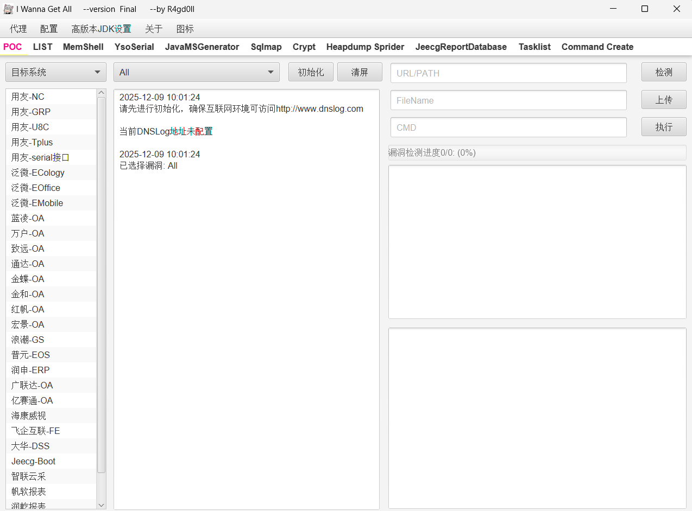

## 更新亮点

### （1）ATT模块

无需多言

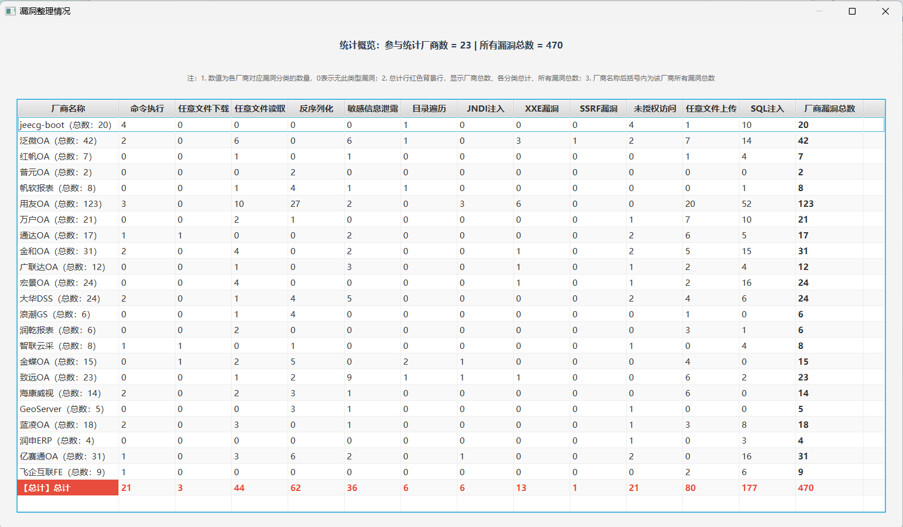

### （2）DNSLog配置

​	可通过初始化或手动获取dnslog，测试查看结果。XXE、JNDI、Serial反序列化漏洞均使用dnslog与echo方式进行检测。

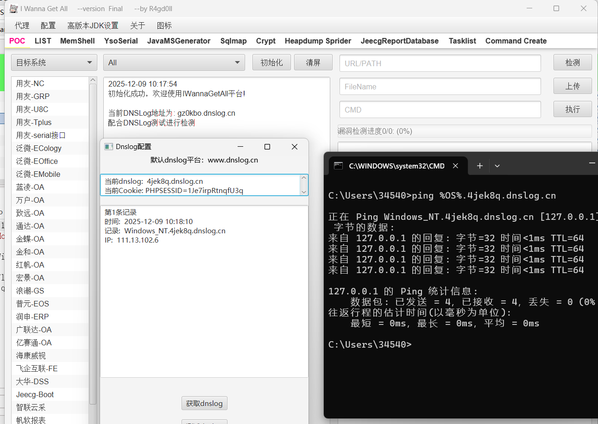

### （3）List批量检测模块

目前调试不完善，但可以使用，IP地址数量限制最多10个。

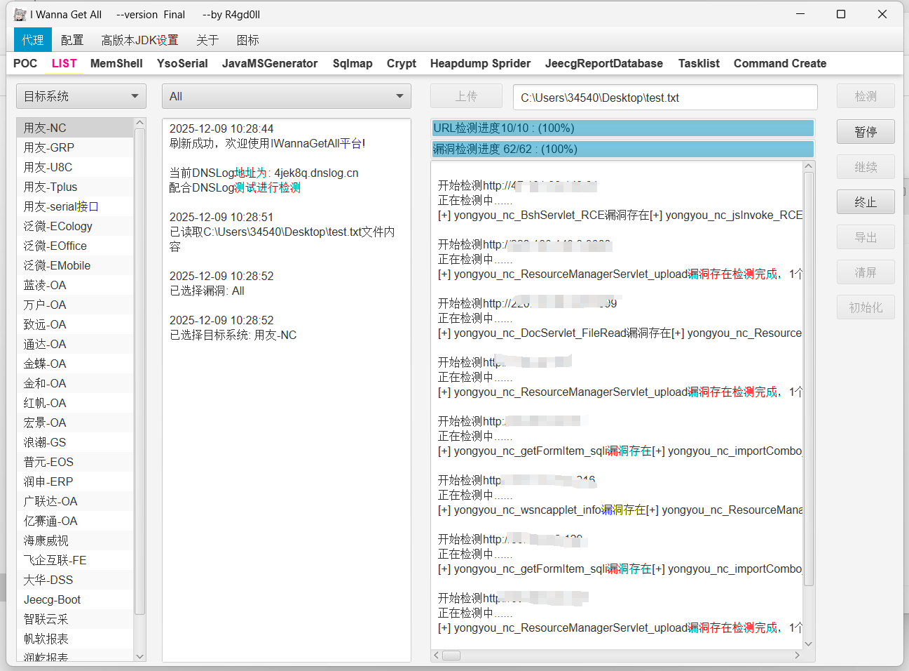

可以导出报告

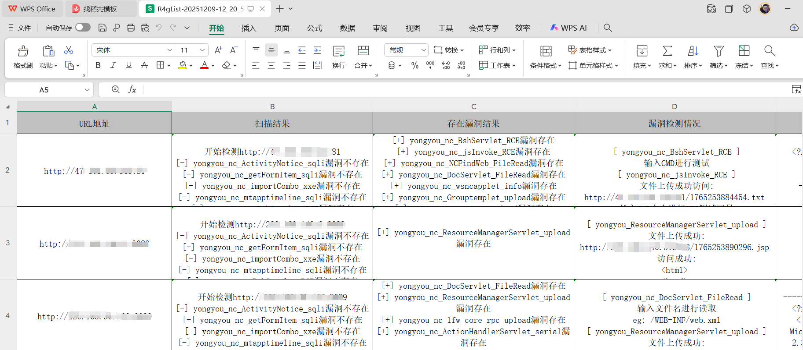

### （4）Memshell模块

新增geoserver内存马注入功能，注入接口/wfs，2种方式

新增“智联云采”内存马注入功能，注入接口/adpweb/verifyToken(参考链接https://forum.butian.net/share/4131)

### （5）Ysoserial模块

集成ysuserial-all的相关功能(参考链接https://github.com/su18)

新增gadget  -  SpringBypassJDK17(参考链接https://fushuling.com/index.php/2025/08/21/%e9%ab%98%e7%89%88%e6%9c%acjdk%e4%b8%8b%e7%9a%84spring%e5%8e%9f%e7%94%9f%e5%8f%8d%e5%ba%8f%e5%88%97%e5%8c%96%e9%93%be/)

需配置高版本jdk17，直接生成

Gadget用法 :     usage1: SpringBypassJDK17 --- CMD-cmd  --- payload: whoami
usage2: SpringBypassJDK17 --- LF-DefineClassFile --- choose classfile
usage3: SpringBypassJDK17--- MemShell
usage4:  R4gd0ll change no params to run
cmd ---- put header "cmd: whoami"
memshell ---- put header "shell: [antsword|godzilla|behinder]"
pass:123456,key:key

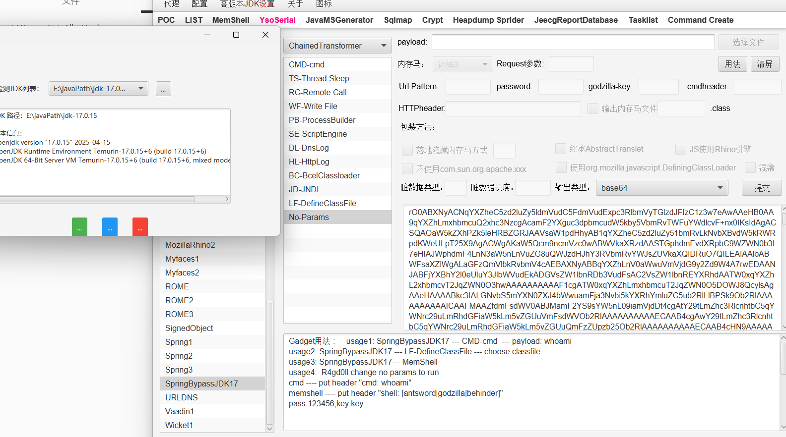

测试环境可自行编写搭建

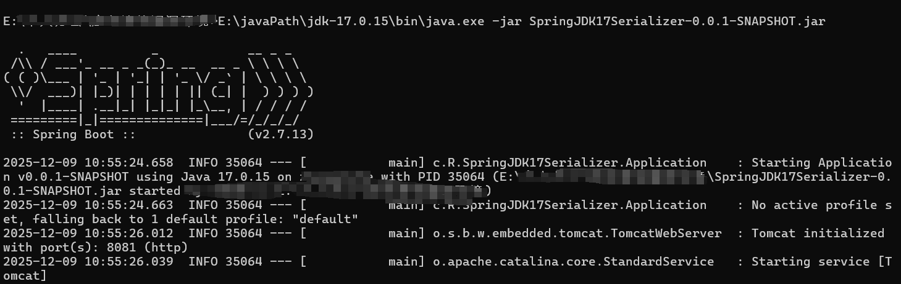

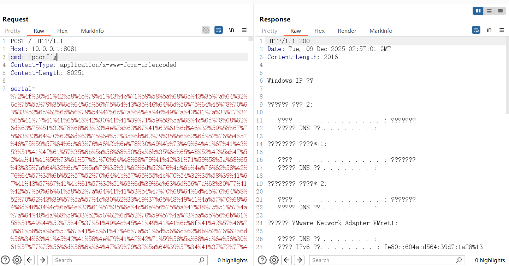

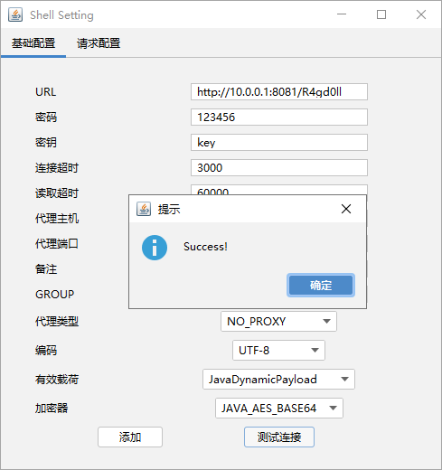

### （6）JavaMSGenerator模块

集成pen4uin师傅jmg项目(参考链接https://github.com/pen4uin/java-memshell-generator)

额外添加若依interceptor内存马(参考链接https://xz.aliyun.com/news/10099)

classloader通用内存马

thymeleaf表达式绕过

##### 示例1：（若依4.8.1 thymeleaf表达式命令回显）

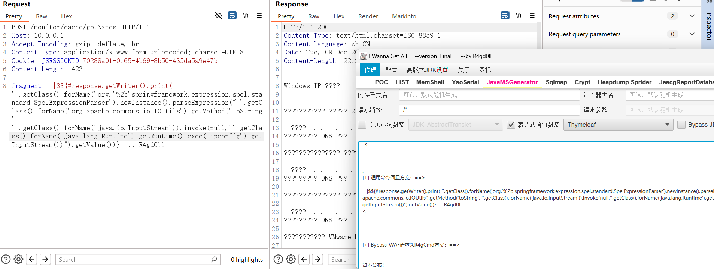

##### 示例2：（若依4.8.1 thymeleaf表达式注入内存马）

方式：沙箱逃逸、新版本Spring spel表达式长度10000限制绕过、若依ApplicationContext注册问题

注入内存马方式：SpringMVC--RuoYiInterceptor--thymeleaf表达式封装


### （7）JeecgReportDatabase模块

https://www.cve.org/CVERecord?id=CVE-2025-51825

https://github.com/jeecgboot/JeecgBoot/issues/8335

CVE编号：CVE-2025-51825（R4gd0ll）

```
3.8.0版本黑名单绕过接管数据库
首次执行创建在线报表查询当前数据库,后续执行均使用当前报表
配置当前使用数据库，防止非跨库表查询失败
若执行失败建议使用自定义SQL语句
勾选自定义SQL优先使用
```

拥有在线报表访问权限的任意用户，可绕过jeecg内置黑名单，实现数据库接管。

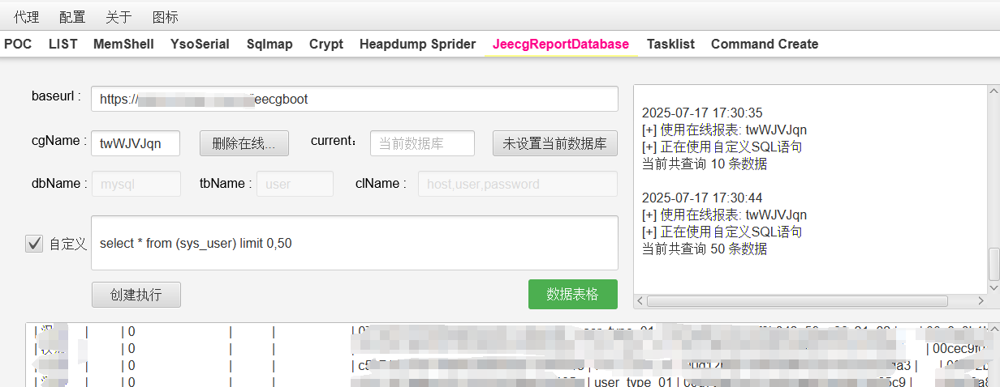

### （8）powershell反弹shell最简命令

采用utf-16、Bas64编码最简化windows反弹shell命令，解决多参困境

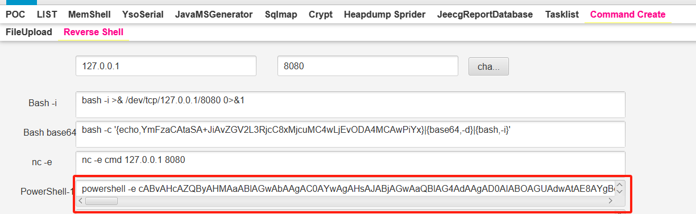


#### 基本介绍

集成漏洞系统包括：用友、泛微、蓝凌、万户、致远、通达、帆软、金蝶、金和、红帆、宏景、浪潮、普元、亿赛通、海康威视、飞企互联、大华DSS、jeecg-boot

集成memshell功能：用友NC、用友U8C、亿赛通、帆软channel、jeecgboot注入内存马。

目前集成385漏洞，包括nday、1day（未公开poc）


java环境
java version "1.8.0_121"
Java(TM) SE Runtime Environment (build 1.8.0_121-b13)
Java HotSpot(TM) 64-Bit Server VM (build 25.121-b13, mixed mode)

基于Apt-T00ls二次开发工具，I Wanna Get All 安全工具, 严禁一切未授权漏洞扫描攻击

使用工具或文章转发用于其他途径，请备注作者及工具地址来源。

使用工具前建议判断系统指纹框架，部分漏洞为接口探测存活判断是否成功，实际利用情况以执行情况为准

很多误报还需要完善，欢迎各位提issues


#### 更新

更新漏洞
帆软报表ReportServer漏洞
帆软报表channel hsql黑名单绕过内存马注入


jeecg-boot testconnection pgsql内存马注入


其他oa漏洞共37个        


#### ATT模块

##### 示例1：

用友NC 漏洞检测 (选择OA类型 -- 选择漏洞 -- 输入URL -- 检测)


用友NC 漏洞利用(选择OA类型 -- 选择漏洞 -- 输入URL -- 输入命令 -- 执行)


用友NC 文件上传(选择OA类型 -- 选择漏洞 -- 输入URL -- 上传文件 -- 执行)


#### MemShell模块

        1. 支持冰蝎3.0、哥斯拉、蚁剑、suo5、cmdecho、neoReGeorg、自定义内存马
        2.  支持输出源码、Base64、hex、gzip格式payload
        3. 用友NC反序列化 集成接口反序列化（测试环境）
        4.  用友U8C反序列化 集接口反序列化（测试环境）
        5. 亿赛通XStream反序列化 集接口反序列化（测试环境）
        6.  用友NC内存马支持bypass脏数据传入，默认为100字节


##### 示例2：

(*ActionHandlerSevlet及其他接口均使用CC6NC链注入）

用友NC冰蝎内存马


用友NC 哥斯拉内存马注入


用友NC cmdEcho内存马注入


用友NC 自定义内存马注入(使用蚁剑ClassByte字节码)，输入类名、Base64编码字节码、脏数据(可选)


其余功能均可实现，不做展示。

##### 示例3：

用友U8Cloud 冰蝎内存马注入（其余内存马均可实现注入）


用友U8Cloud cmdEcho内存马注入


##### 示例4：

冰蝎内存马payload 源码、base64 payload等生成展示(用友NC示例)


#### Sqlmap模块

​     根据提示输入内容执行，集成调用sqlmap


##### 示例5：

泛微CheckServer-Sql注入，检测漏洞存在后，将payload字段下内容保存为req文件，使用sqlmap模块构造参数


#### Crypt模块

        1. 各类OA加解密
        2.  各类编码解码
        3. Class类反编译、class字节码生成(base64格式、gzip-base64格式)
        4.  class反编译仅文件读取、base64格式(yv66)、gzip-base64格式(H4sI)可反编译

##### 示例6

用友NC数据库密码 加解密


##### 示例7

classbyte字节码解码（class文件导入加解码，base64字节码编码解码）

恶意类常用加解码方式: Base64-Gzip、Hex-Gzip等


#### TaskList模块

​     保留Apt-T00ls原有功能:杀软识别

##### 示例8


#### Command Create模块

​     保留Apt-T00ls原有功能:常用命令创建

##### 示例9


#### 其他

部分sql注入漏洞tamper脚本放入tamper路径下

#### 免责说明

本工具仅面向合法授权的企业安全建设行为，如您需要测试本工具的可用性，请自行搭建靶机环境。

在使用本工具进行检测时，您应确保该行为符合当地的法律法规，并且已经取得了足够的授权。请勿对非授权目标进行扫描。

如您在使用本工具的过程中存在任何非法行为，您需自行承担相应后果，本人将不承担任何法律及连带责任。

在安装并使用本工具前，请您务必审慎阅读、充分理解各条款内容，限制、免责条款或者其他涉及您重大权益的条款可能会以加粗、加下划线等形式提示您重点注意。 除非您已充分阅读、完全理解并接受本协议所有条款，否则，请您不要安装并使用本工具。您的使用行为或者您以其他任何明示或者默示方式表示接受本协议的，即视为您已阅读并同意本协议的约束
